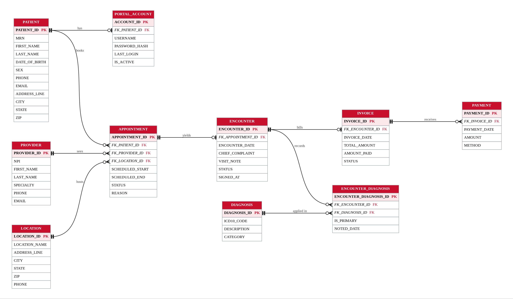

# 🏥 HealthCare Clinic ERP

> A full-stack, production-grade hospital administration system built with React, Node/Express, and SQLite — featuring a 5,000-patient registry, real-time billing & AR tracking, clinical analytics, and a live SQL query viewer.

**ITC 6000 — Database Management Systems · Northeastern University**

---

## ✨ Features

| Module | Highlights |
|---|---|
| 📊 **Dashboard** | KPI cards (patients, appointments, billed, AR), revenue-by-provider bar chart, appointment status donut, 12-month revenue trend line chart |
| 👥 **Patient Registry** | 5,000+ patients, server-side search & pagination, portal account status, Add/Edit CRUD forms |
| 📅 **Appointment Manager** | Full appointment lifecycle (Scheduled → Checked In → Completed), date filter, status tabs, Book/Cancel/No-Show actions |
| 🩺 **Provider Roster** | Productivity cards — signed visits, gross billed, collected, collection rate |
| 💰 **Billing & AR** | Invoice ledger with Open/Partial/Paid filter, record payment workflow, outstanding AR KPI |
| 🔬 **Clinical Insights** | Top-10 ICD-10 diagnoses bar chart, patient visit summary with encounter history |
| 🗂️ **Data Model / ERD** | Visual entity-relationship diagram of all 10 tables |
| 🔍 **Global Command Search** | `Cmd+K` palette — searches patients and providers across the entire database |
| 💾 **Live SQL Viewer** | Floating `</> View SQL` drawer shows the exact SQL powering each page — perfect for demos |
| 🌙 **Dark Mode** | Professional layered dark theme (Linear/Vercel-inspired), toggleable with one click |
| 📤 **CSV Export** | Export dialog with column selection, scope (current page / all matching), active filter chips, optional date range |
| 📱 **Fully Responsive** | Mobile-first — hamburger drawer sidebar, condensed header, touch-friendly tap targets |

---

## 🛠 Tech Stack

### Frontend
| Technology | Role |
|---|---|
| **React 19 + Vite 8** | UI framework and build tool |
| **Tailwind CSS v4** | Utility-first styling |
| **shadcn/ui** | Accessible component primitives (Dialog, Tabs, Popover, Calendar, Badge, Toast) |
| **Recharts** | Revenue and clinical charts |
| **Lucide React** | Icon library |
| **Sonner** | Toast notifications |
| **react-day-picker + date-fns** | Modern date/time picker |

### Backend
| Technology | Role |
|---|---|
| **Node.js + Express 5** | REST API server |
| **better-sqlite3** | Synchronous SQLite driver (fast, no async overhead) |
| **@faker-js/faker** | Realistic synthetic patient data generation |

---

## 🗄️ Database Schema

**10 tables normalized to 3NF:**

```
PATIENT            → PORTAL_ACCOUNT
PATIENT            → APPOINTMENT → PROVIDER, LOCATION
APPOINTMENT        → ENCOUNTER  → ENCOUNTER_DIAGNOSIS → DIAGNOSIS
ENCOUNTER          → INVOICE    → PAYMENT
```

| Table | Purpose |
|---|---|
| `PATIENT` | Demographics, MRN, contact info |
| `PORTAL_ACCOUNT` | Patient web portal login & status |
| `PROVIDER` | Physician roster, specialty, NPI |
| `LOCATION` | Clinic facility sites |
| `APPOINTMENT` | Scheduled slots with status FSM |
| `ENCOUNTER` | Clinical visit record, signed notes |
| `DIAGNOSIS` | ICD-10 code reference table |
| `ENCOUNTER_DIAGNOSIS` | M:N link with primary/secondary flag |
| `INVOICE` | Billed amount, paid amount, status |
| `PAYMENT` | Individual payment transactions |

### Entity-Relationship Diagram



---

## 🚀 Local Development

### Prerequisites
- Node.js ≥ 18
- npm ≥ 9

### 1 · Clone and install root dependencies

```bash
git clone https://github.com/<your-username>/healthcare-clinic-erp.git
cd healthcare-clinic-erp
npm install
```

> **macOS note (Anaconda/libtool conflict):** If `better-sqlite3` fails to build with a `libtool` or linker error, prefix the install with a clean PATH:
> ```bash
> PATH="/usr/bin:/bin:/usr/sbin:/sbin:$PATH" npm install
> ```

### 2 · Install server dependencies and seed the database

```bash
cd server
npm install
node seed.js        # seeds clinic.db with 5,000 patients + full dataset
cd ..
```

> The seed takes ~10–20 seconds and generates patients, providers, locations,
> appointments, encounters, diagnoses, invoices, and payments.

### 3 · Start the API server (Terminal 1)

```bash
cd server
node index.js
# → Express clinic API server is running on http://localhost:3001
```

### 4 · Start the frontend dev server (Terminal 2)

```bash
npm run dev
# → Local:  http://localhost:5174
```

Open **http://localhost:5174** in your browser.

---

## 🏗️ Production Build

To build the full production bundle (frontend + server deps):

```bash
npm run build          # builds React app into dist/, seeds DB
npm run start          # starts Express which serves both API + static app
```

The Express server reads `NODE_ENV=production` and serves the built React app from `../dist` with a catch-all route for SPA navigation.

---

## ☁️ Deploying to Render

A `render.yaml` is included at the project root. Connect your GitHub repo to Render and it will:

1. Run the build command: install deps, build Vite frontend, seed the database
2. Start the Express server which serves both `/api/*` routes and the React SPA
3. Auto-seed on first start if the database is empty

**Environment variables set by render.yaml:**
- `NODE_ENV=production`
- `PORT` — set automatically by Render

---

## 📁 Project Structure

```
clinic-dashboard/
├── src/
│   ├── components/          # Reusable UI components
│   │   ├── Sidebar.jsx      # Navigation (desktop fixed + mobile drawer)
│   │   ├── DataTable.jsx    # Server-paginated table with search
│   │   ├── KpiCard.jsx      # Dashboard metric cards
│   │   ├── ExportDialog.jsx # CSV export configuration dialog
│   │   ├── SqlViewer.jsx    # Live SQL query drawer
│   │   ├── GlobalSearch.jsx # Cmd+K search palette
│   │   ├── FormModal.jsx    # Reusable CRUD modal wrapper
│   │   ├── DateTimePicker.jsx # Calendar + time slot picker
│   │   ├── PatientForm.jsx  # Patient CRUD form
│   │   ├── AppointmentForm.jsx
│   │   ├── ProviderForm.jsx
│   │   └── PaymentForm.jsx
│   ├── pages/               # Page-level components
│   │   ├── Dashboard.jsx
│   │   ├── Patients.jsx
│   │   ├── PatientDetail.jsx
│   │   ├── Appointments.jsx
│   │   ├── Providers.jsx
│   │   ├── Billing.jsx
│   │   ├── Clinical.jsx
│   │   └── DataModel.jsx
│   ├── lib/
│   │   ├── api.js           # Fetch helpers (apiGet, apiPost, apiPut, apiDelete)
│   │   └── utils.js
│   └── index.css            # Global styles + dark mode CSS variables
├── server/
│   ├── index.js             # Express API (40+ endpoints)
│   ├── seed.js              # Faker-powered data seeder
│   ├── schema.sql           # CREATE TABLE statements
│   └── clinic.db            # SQLite database (generated, git-ignored)
├── public/
│   ├── erd.png              # Entity-relationship diagram
│   └── clinic_erp.db        # Legacy browser-side database
├── render.yaml              # Render deployment configuration
└── package.json
```

---

## 📸 Screenshots

| Dashboard (Light) | Dashboard (Dark) |
|---|---|
| *(screenshot placeholder)* | *(screenshot placeholder)* |

| Patient Registry | Appointment Manager |
|---|---|
| *(screenshot placeholder)* | *(screenshot placeholder)* |

| SQL Query Viewer | CSV Export Dialog |
|---|---|
| *(screenshot placeholder)* | *(screenshot placeholder)* |

---

## 👨‍💻 Author

**Darpan Radadiya**  
ITC 6000 — Database Management Systems  
Northeastern University · 2026

---

## 📄 License

MIT — free to use and modify for academic or commercial purposes.
